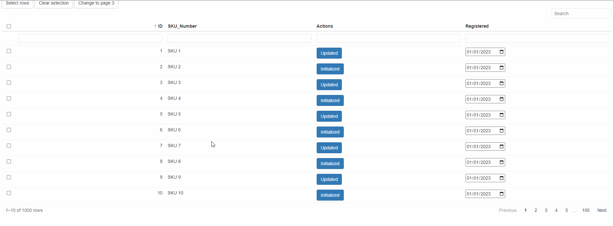

Let's dive into an example that showcases the combined use of reactable and reactable.extras to create an interactive table with various features:

- Filtering
- Searching
- Multiple row selection
- Custom buttons in the "Actions" column
- Date input for the "Registered" column

```r
library(shiny)
library(reactable)
library(reactable.extras)

data <- data.frame(
  ID = 1:1000,
  SKU_Number = paste0("SKU ", 1:1000),
  Actions = rep(c("Updated", "Initialized"), times = 20),
  Registered = as.Date("2023/1/1")
)

ui <- fluidPage(
  # Include reactable.extras in your UI
  reactable_extras_dependency(),
  actionButton("select_btn", "Select rows"),
  actionButton("clear_btn", "Clear selection"),
  actionButton("page_btn", "Change to page 3"),
  reactableOutput("table")
)

server <- function(input, output, session) {
  output$table <- renderReactable({
    # Create a reactable table with enhanced features
    reactable(
      data,
      filterable = TRUE,
      searchable = TRUE,
      selection = "multiple",
      columns = list(
        ID = colDef(name = "ID"),
        SKU_Number = colDef(name = "SKU_Number"),
        Actions = colDef(
          name = "Actions",
          cell = button_extra("button", class = "btn btn-primary")
        ),
        Registered = colDef(
          cell = date_extra("Registered", class = "date-extra")
        )
      )
    )
  })

  observeEvent(input$select_btn, {
    # Select rows
    updateReactable("table", selected = c(1, 3, 5))
  })

  observeEvent(input$clear_btn, {
    # Clear row selection
    updateReactable("table", selected = NA)
  })

  observeEvent(input$page_btn, {
    # Change current page
    updateReactable("table", page = 3)
  })

}

shinyApp(ui, server)

```





