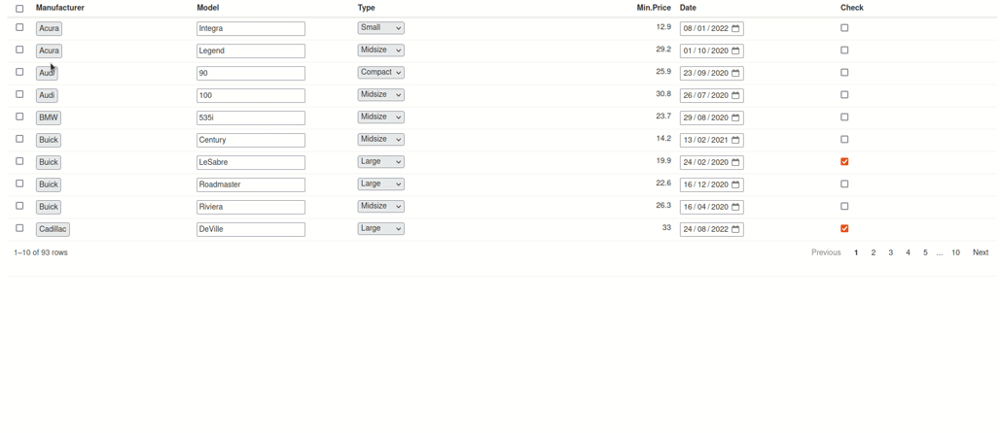
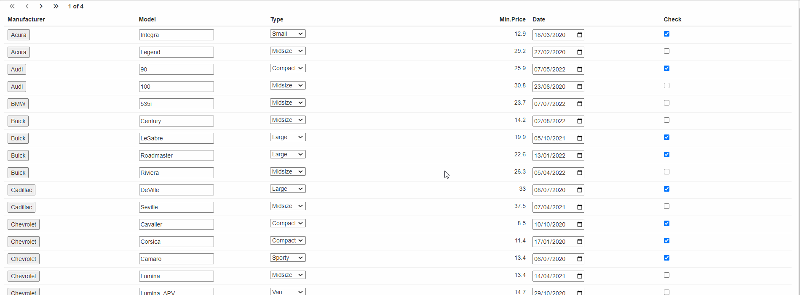

You can use custom inputs inside your reactable column.

Supported types for now:

- text input: `text_extra`
- button: `button_extra`
- dropdown: `dropdown_extra`
- date: `date_extra`
- checkbox: `checkbox_extra`
- tooltips: `tooltip_extra`

It's possible to apply additional styling to your inputs by passing `class` argument:

`checkbox_extra("check", class = "checkbox-extra")`

Also it's important to import javascript dependencies by adding to `ui`:

`reactable.extras::reactable_extras_dependency()`

All events of your inputs will be tracked and can be used in your shiny server.

Example application:

```r
library(shiny)
library(reactable)
library(reactable.extras)
string_list <- function(values) {
  paste0(
    "{", paste0(names(values), " : ", unlist(values), collapse = ", "), "}"
  )
}

shinyApp(
  ui = fluidPage(
    reactable.extras::reactable_extras_dependency(),
    reactableOutput("react"),
    hr(),
    textOutput("date_text"),
    textOutput("button_text"),
    textOutput("check_text"),
    textOutput("dropdown_text"),
    textOutput("text")
  ),
  server = function(input, output) {
    output$react <- renderReactable({
      # preparing the test data
      df <- MASS::Cars93[, 1:4]
      df$Date <- sample(seq(as.Date("2020/01/01"),
                            as.Date("2023/01/01"),
                            by = "day"),
                        nrow(df))
      df$Check <- sample(c(TRUE, FALSE), nrow(df), TRUE)
      reactable(
        df,
        columns = list(
          Manufacturer = colDef(
            cell = button_extra("button", class = "button-extra")
          ),
          Check = colDef(
            cell = checkbox_extra("check", class = "checkbox-extra"),
            align = "left"
          ),
          Date = colDef(
            cell = date_extra("date", class = "date-extra")
          ),
          Type = colDef(
            cell = dropdown_extra(
              "dropdown",
              unique(df$Type),
              class = "dropdown-extra"
            )
          ),
          Model = colDef(
            cell = text_extra(
              "text"
            )
          )
        )
      )
    })
    output$date_text <- renderText({
      req(input$date)
      values <- input$date
      paste0(
        "Date: ",
        string_list(values)
      )
    })
    output$check_text <- renderText({
      req(input$check)
      values <- input$check
      paste0(
        "Check: ",
        string_list(values)
      )
    })
    output$button_text <- renderText({
      req(input$button)
      values <- input$button
      paste0(
        "Button: ",
        string_list(values)
      )
    })

    output$dropdown_text <- renderText({
      req(input$dropdown)
      values <- input$dropdown
      paste0(
        "Dropdown: ",
        string_list(values)
      )
    })

    output$text <- renderText({
      req(input$text)
      values <- input$text
      paste0(
        "Dropdown: ",
        string_list(values)
      )
    })
  }
)

```




You can also use `{tippy}` to add tooltips to your reactable columns:

```R
library(shiny)
library(reactable)
library(reactable.extras)
string_list <- function(values) {
  paste0(
    "{", paste0(names(values), " : ", unlist(values), collapse = ", "), "}"
  )
}

df <- MASS::Cars93[, 1:4]
df$Date <- sample(seq(as.Date("2020/01/01"),
                      as.Date("2023/01/01"),
                      by = "day"),
                  nrow(df))
df$Check <- sample(c(TRUE, FALSE), nrow(df), TRUE)

shinyApp(
  ui = fluidPage(
    reactable.extras::reactable_extras_dependency(),
    reactable_extras_ui("table"),
    hr(),
    textOutput("date_text"),
    textOutput("button_text"),
    textOutput("check_text"),
    textOutput("dropdown_text"),
    textOutput("text")
  ),
  server = function(input, output) {
    reactable_extras_server(
      "table",
      data = df,
      columns = list(
        Manufacturer = colDef(
          header = tooltip_extra(content = "Manufacturer type"), #tooltip
          cell = button_extra("button", class = "button-extra")
        ),
        Check = colDef(
          header = tooltip_extra(content = "Checkbox"),
          cell = checkbox_extra("check", class = "checkbox-extra"),
          align = "left"
        ),
        Date = colDef(
          header = tooltip_extra(content = "Date input"),
          cell = date_extra("date", class = "date-extra")
        ),
        Type = colDef(
          header = tooltip_extra(content = "Type dropdown"),
          cell = dropdown_extra(
            "dropdown",
            unique(df$Type),
            class = "dropdown-extra"
          )
        ),
        Model = colDef(
          header = tooltip_extra(content = "Model input"),
          cell = text_extra(
            "text"
          )
        )
      )
    )
})

```



